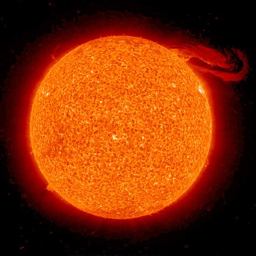

# Soleil
Le Soleil est l’étoile du Système solaire.

 trouvée sur (https://fr.wikipedia.org/wiki/Soleil).

## Caractéristiques

- Masse : 1.989 x 1030 kg
- Diamètre : 1 392 684 km
- Symbole : &#9788;
